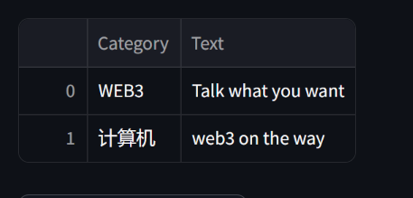
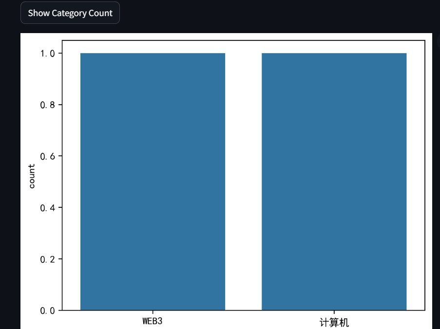
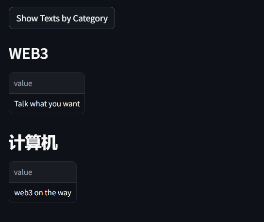

# 基于python实现的区块链
## 基础功能
1.新增块

2.发布你想说的任何东西(设置话题属于什么类)

去中心化

3.新增节点，可以是本机开多个端口实现，也可以不同终端

4.实现共识算法

5.返回链

## ETL(可视化功能)
通过streamlit搭建关于话题区块链的数据可视化程序

1.输出表格

2.按类别计数的条形图

3.按类别分类的话题

[Learn from](https://hackernoon.com/learn-blockchains-by-building-one-117428612f46)
